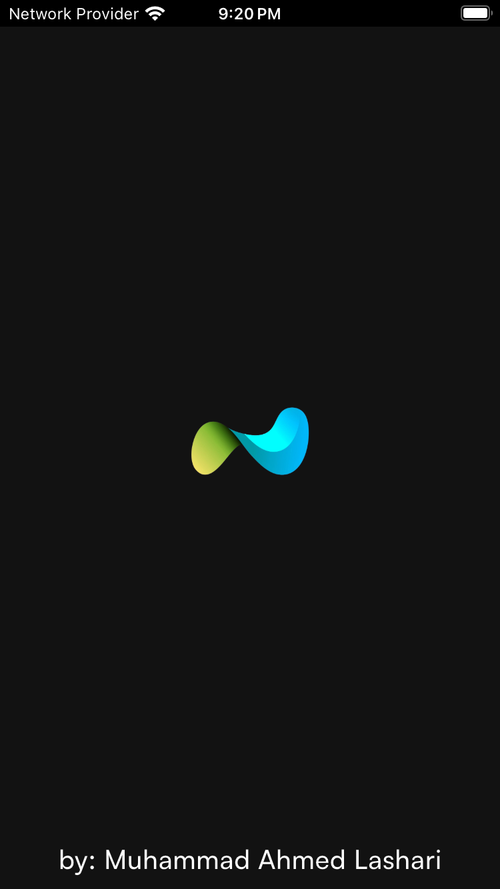
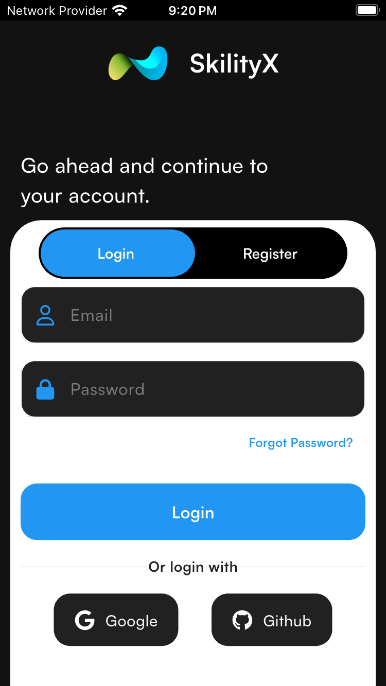
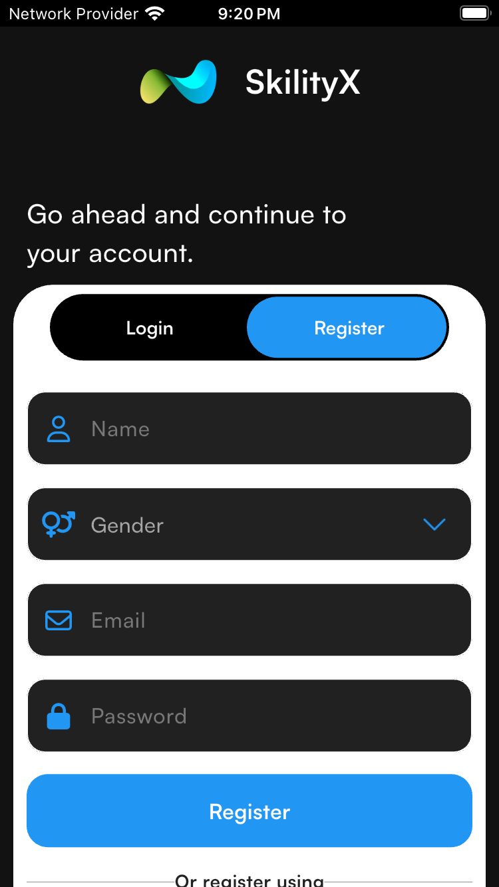
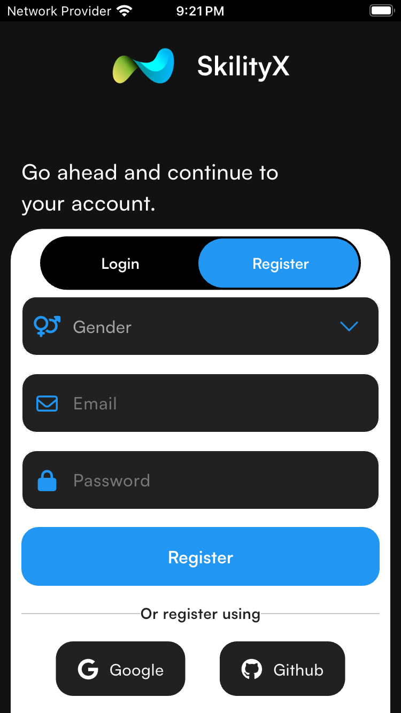
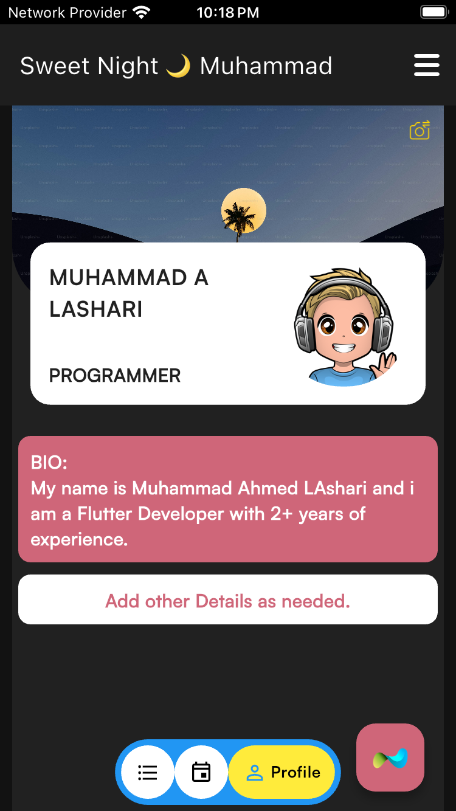
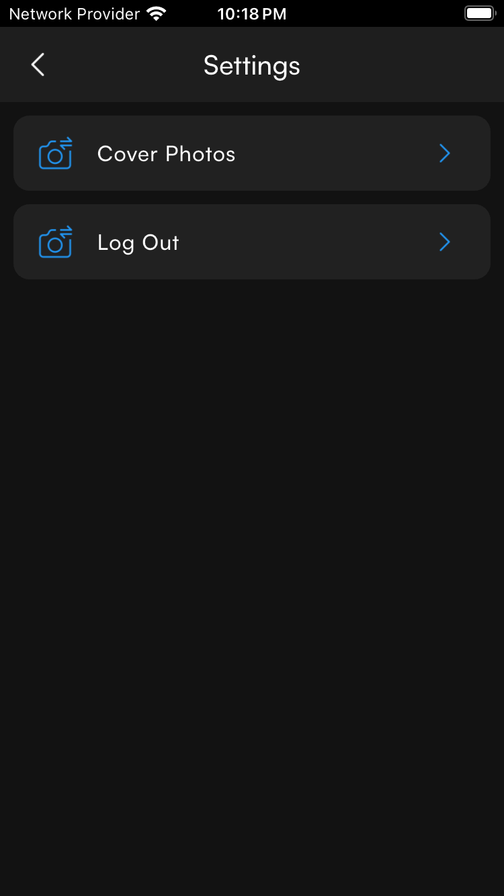
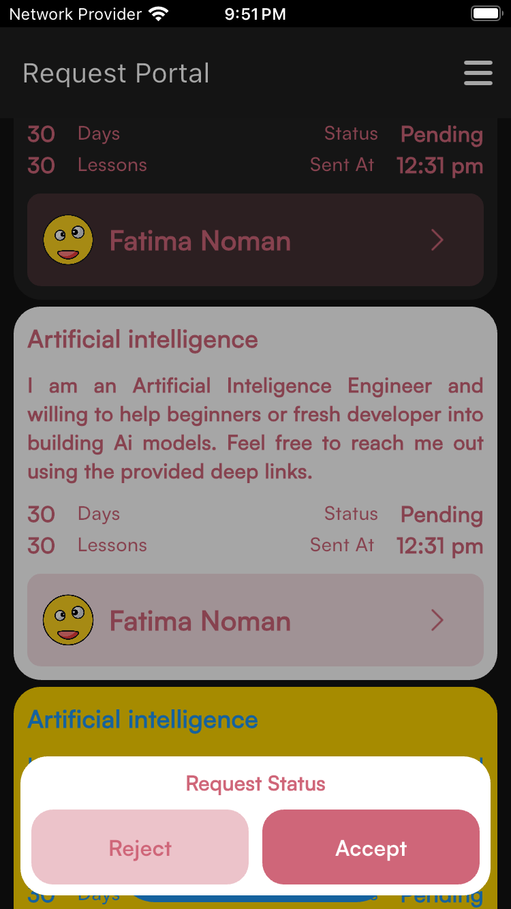
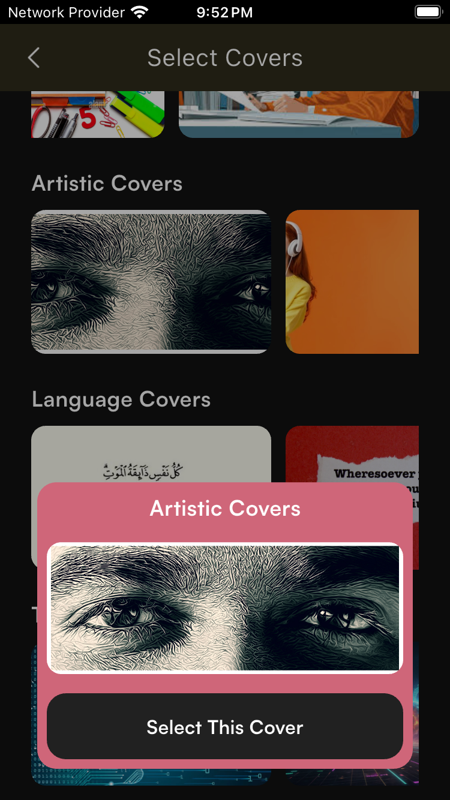

# 🚀 SkilityX – *Skill. Community. Exchange.*

<p align="center">
  
</p>

> *Learn. Teach. Grow.*

---

## 📲 Features

- 🎯 Select a skill to **learn** or **teach**
- 🧠 Skill-based **user onboarding**
- 🤝 Send and receive **requests** to connect with other users
- 🗂️ Clean MVVM + Riverpod state management architecture
- ☁️ Firebase integration -> Firestore + Auth + Cloud Messaging(Android) + Crashlytics [Integrated]
- 💬 Contact sharing after request acceptance
- ✨ Beautiful and intuitive UI for both **skill seekers** and **skill sharers**.

---

## 🎬 App Preview

 | Custom Nav Bar                                        | Home Work Flow                                          |
 | ----------------------------------------------------- | ------------------------------------------------------- |
 |           |                |

## 📸 SS
 | Splash                                        | Auth Login                                          |
 | ----------------------------------------------------- | ------------------------------------------------------- |
 |           |                |
 
 | Auth Signup                                        | Auth Signup                                          |
 | ----------------------------------------------------- | ------------------------------------------------------- |
 |           |                |

 | User Profile                                         | Settings Screen (further options can be added)                                          |
 | ----------------------------------------------------- | ------------------------------------------------------- |
 |           |                |


 | Request Options                                        | Profile Cover Screen                                          |
 | ----------------------------------------------------- | ------------------------------------------------------- |
 |           |                |

## 🛠️ Getting Started

1. **Clone the repository**
   ```bash
   git clone https://github.com/Ahmed-lashari/SkilityX.git
   ```

2. **Install dependencies**

   ```bash
   flutter pub get
   ```

3. **Setup Firebase**

   * Connect your project to Firebase
   * Add the required `google-services.json` and `GoogleService-Info.plist` files

4. **Run the app**

   ```bash
   flutter run
   ```

---

## 🔍 Testing Strategy


* Integration Testing: For flow-based testing
> Only inegrated tests for some important features are written.
---

## 🔔 Firebase Firestore Structure

> Will be shared

---

## 🚧 What’s Missing

The current version is a **Flutter UI + Firebase integrated**, but to make SkilityX a scalable and production-ready app, the following enhancements are **planned**:

* 🔔 Push Notifications (for iOS)
* 🎯 Further responsive UI as per user actions.

---

## 👥 The Vision

SkilityX connects **skill seekers** with **skill sharers** in a community built on **knowledge exchange**. Users can:

* Discover a skill
* Send requests to others.
* Accept requests and discuss further via exchanging contacts.

---


> Made with 💙 using Flutter and Firebase by **Muhammad Ahmed Lasahri**.


